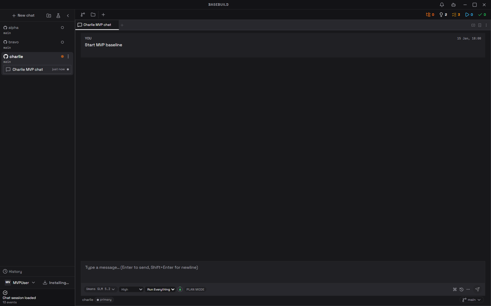
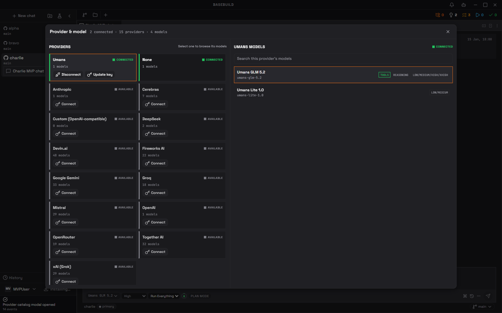
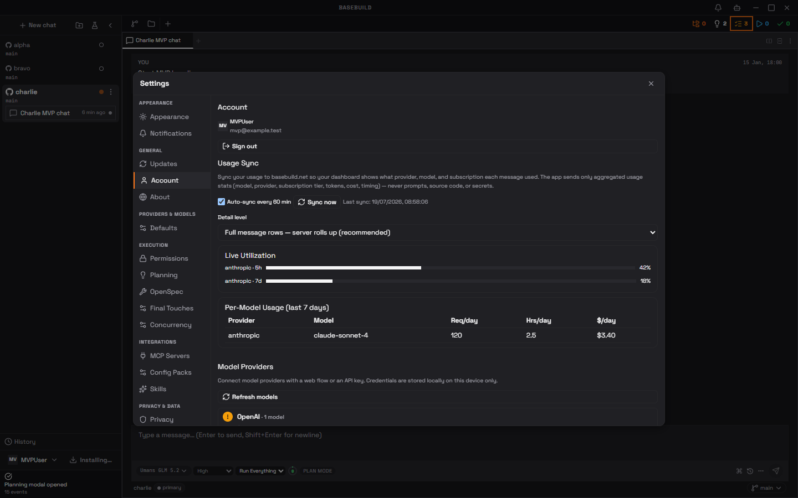

# Basebuild

**Run AI coding models from one open source desktop workspace.**

Basebuild combines native agent chat, tool approvals, MCP, planning, terminals,
and source control in a local-first Tauri app. With your consent, it also sends
anonymous provider and model usage aggregates to basebuild.net. Those aggregates
help build community-powered estimates of real subscription value, including how
many useful hours different plans and models actually provide.

## Install

Download platform files from the
[latest GitHub release](https://github.com/basebuild-net/basebuild/releases/latest).

### Windows x64

PowerShell:

```powershell
irm https://raw.githubusercontent.com/basebuild-net/basebuild/main/install.ps1 | iex
```

The script downloads and opens the NSIS installer. A portable zip is also
available on the release page.

### Linux x64

AppImage:

```bash
curl -fsSL https://raw.githubusercontent.com/basebuild-net/basebuild/main/install.sh | sh
```

Debian or Ubuntu:

```bash
curl -fL https://github.com/basebuild-net/basebuild/releases/latest/download/Basebuild-linux-x86_64.deb -o /tmp/basebuild.deb && sudo apt install /tmp/basebuild.deb
```

### macOS

The published v0.0.25 release does not contain the advertised macOS DMG. Do not
use the install script on macOS until the release page lists
`Basebuild-macos-universal.dmg`. You can still
[build from source](#build-from-source).

Remote install commands execute scripts from the default branch. Review
[`install.ps1`](./install.ps1) or [`install.sh`](./install.sh) first, or replace
`main` in the raw URL with a trusted commit SHA.

## See it

<table>
  <tr>
    <td width="33%"><a href="./screenshots/readme-workspace.png"></a></td>
    <td width="33%"><a href="./screenshots/readme-models.png"></a></td>
    <td width="33%"><a href="./screenshots/readme-usage.png"></a></td>
  </tr>
  <tr>
    <td align="center">Agent workspace</td>
    <td align="center">Models and providers</td>
    <td align="center">Usage and plan value</td>
  </tr>
</table>

Click a thumbnail for the full-size screenshot.

## Attribution

Basebuild uses an attribution-required license. You may use, improve, and
redistribute it, but you must credit [basebuild.net](https://basebuild.net).
See [`LICENSE`](./LICENSE) for the complete terms.

## Killer features

- **Run the model you want.** Connect supported providers or an
  OpenAI-compatible endpoint, then switch provider, model, effort, and
  permission mode per chat.
- **Native agent workspace.** Streamed chat, gated tools, MCP servers, project
  context, terminals, and Git live in one desktop window.
- **Community usage estimates.** Optional anonymous sync contributes provider,
  model, token, cost, and timing aggregates to a shared evidence base for
  comparing plan value and usable hours.
- **Planning that survives the chat.** Turn ideas into scoped OpenSpec plans,
  queue isolated worktree runs, and keep portable planning data in project
  files.
- **Local-first by default.** Projects, prompts, source code, credentials, and
  terminal output stay on your machine. Anonymous upload can be disabled in
  Settings under Privacy.

Usage sync never includes prompts, responses, source code, terminal output,
secrets, or credentials. It is controlled by separate local collection and
anonymous upload settings.

## Build from source

Requires Node.js 20+, stable Rust, and the native C or C++ toolchain for your
operating system.

```bash
npm install
npm run tauri dev
```

Packaging commands and platform prerequisites are in
[`docs/DEVELOPMENT.md`](./docs/DEVELOPMENT.md).

## Contributing and project docs

Read [`AGENTS.md`](./AGENTS.md) before making changes. Architecture, testing,
workflow, and design guides live in [`docs/agents/`](./docs/agents/). Basebuild's
portable planning skills live in [`skills/`](./skills/).
