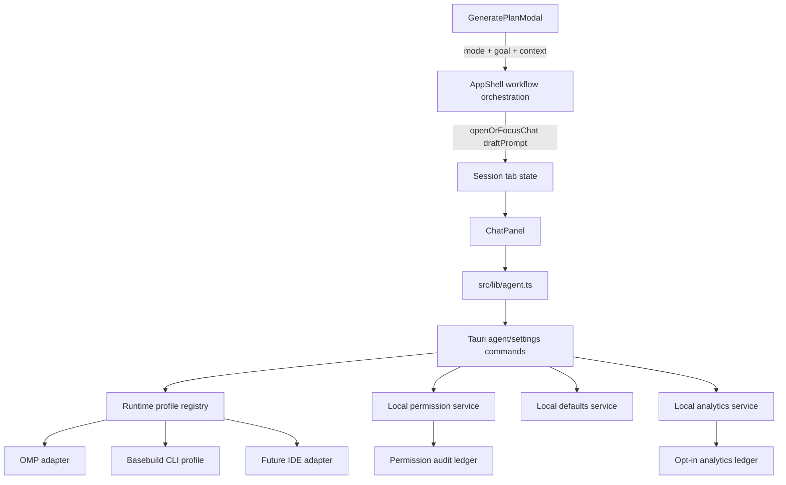

# Design: Chat Context Defaults

## Context

Current state observed in code:

- `GeneratePlanModal` calls `onGenerate` for `from-context` mode.
- `AppShell.handleGenerateFromGoal` either opens the Project Description modal or creates a placeholder plan with `tags: ["generated"]`.
- `ChatPanel` starts OMP on mount, keeps input state internally, and has no API for receiving a draft prompt from a workflow.
- `AgentManager` directly spawns `omp` through a PTY; the code comments say adapter-agnostic, but there is no typed adapter/profile/capability boundary yet.
- `SettingsModal` has Updates/Config Packs/About tabs only; no defaults or permission UI exists.
- `session_tabs` stores `terminal_id` and `file_path`, but no general tab metadata/payload column.

## Goals / Non-Goals

**Goals**:

- Make `Generate from context` visibly open/focus chat and stage a planning prompt.
- Keep AI plan generation auditable: user can inspect/edit the prompt before sending by default.
- Introduce a real runtime profile/defaults boundary for OMP-first chat, future Basebuild CLI, and other CLIs/IDEs.
- Add local settings/permissions primitives required before agents run commands or auto-send prompts.
- Establish opt-in-only usage analytics, local analytics ledgers, permission audit trails, and data export/delete controls before any telemetry upload exists.
- Add first-run setup, health checks, and action registry seams so foundational features share one default/permission/availability model.
- Move detailed agent instructions out of root `AGENTS.md` into `docs/agents/*` while preserving mandatory routing.

**Non-Goals**:

- Do not implement cloud sync, basebuild.net account behavior, or remote preference storage.
- Do not silently create files, plans, commits, or PRs from generated chat output.
- Do not build a full internal IDE in this change; only the adapter/runtime seams needed to support one later.
- Do not auto-send generated prompts by default.
- Do not enable analytics collection or network upload by default; both require explicit user consent.
- Do not store prompt text, chat messages, source code, terminal output, secrets, or raw absolute paths in analytics events by default.

## Decisions

**Decision**: Route workflow-launched planning through chat draft injection, not direct plan persistence. - **Rationale**: The user asked for a visible chat window, and Basebuild's product stance is wrapper-first and reversible. Prompt drafts avoid silent side effects. **Alternatives**: Keep creating placeholder plans and log a background request; rejected because it hides the agent interaction and reproduces the current failure mode.

**Decision**: Add a small workspace orchestration helper in `AppShell` (or extracted hook if it grows) that can `openOrFocusChat({ draftPrompt })`. - **Rationale**: `GeneratePlanModal` should remain a modal that collects user intent, while session/tab focus belongs to shell state. **Alternatives**: Let `ChatPanel` discover external intent globally; rejected because it couples a panel to unrelated workflows.

**Decision**: Deliver chat draft prompts through typed tab/workspace payload state, with persistence only if needed for restored drafts. - **Rationale**: A draft prompt is a UI payload, not a file path or terminal ID. A typed metadata channel prevents overloading existing tab fields. **Alternatives**: Use `filePath` or title to smuggle drafts; rejected as brittle and unsafe for large prompts.

**Decision**: Keep OMP as the default runtime profile and model all integrations as profiles with capabilities. - **Rationale**: The app is primarily OMP-focused today but must not hardwire OMP syntax into React. Capabilities allow `skills`, `providers`, `commands`, and `info` UI to degrade cleanly. **Alternatives**: Implement only `agent_start/send/stop` for OMP; rejected because settings, permissions, and future CLI support would require rewrites.

**Decision**: Persist defaults and permission rules locally in the existing SQLite state database. - **Rationale**: Matches Basebuild's local-first constraint and existing storage. **Alternatives**: Use localStorage; rejected for backend runtime settings because Rust services also need defaults and permissions.

**Decision**: Treat usage analytics as disabled until explicit opt-in, and separate local collection consent from remote upload consent. - **Rationale**: Basebuild is local-first and must not phone home by default. Local-only analytics can help users inspect their own usage without creating a network privacy risk. **Alternatives**: Enable anonymous telemetry by default; rejected because it violates the project's conservative data posture.

**Decision**: Define a privacy-safe event taxonomy before adding analytics emitters. - **Rationale**: The event schema must prevent prompt text, chat content, source code, terminal output, secrets, and raw paths from entering storage accidentally. **Alternatives**: Add broad event capture and redact later; rejected because sensitive data could already be persisted.

**Decision**: Add a permission audit trail for sensitive runtime actions. - **Rationale**: Users need to understand why an agent ran a command, accessed context, auto-sent a prompt, or uploaded diagnostics. Auditability also helps tests assert that permission gates are enforced. **Alternatives**: Rely on transient prompts only; rejected because decisions become invisible after the prompt closes.

**Decision**: Introduce an action registry seam for user-triggered operations. - **Rationale**: Menu items, buttons, chat slash commands, and future command palette entries should share availability checks and permission behavior. **Alternatives**: Keep handlers inline in components; rejected because new entry points would duplicate permission logic.

**Decision**: Split agent documentation into focused `docs/agents/*` files and keep root `AGENTS.md` as a loader/index. - **Rationale**: The current root guide is long enough that future agents may miss key constraints. A concise index makes routing clearer while preserving detail. **Alternatives**: Keep appending to root `AGENTS.md`; rejected because it increases context clutter.

## Proposed Architecture



### Prompt routing

1. User opens Generate Plans modal.
2. User selects `From project context` and clicks `Generate from context`.
3. Modal passes a typed request to `AppShell`, not directly to `plans.createPlan`.
4. `AppShell` composes the prompt from goal, schematic content, selected context, active project path, and existing plan summary.
5. `AppShell.openOrFocusChat` chooses the active chat, newest chat, or creates a chat tab.
6. `ChatPanel` receives a one-shot `draftPrompt` payload and sets its input field.
7. User sends manually unless settings explicitly allow auto-send and permissions pass.

### Runtime profiles

Minimum profile shape:

```ts
type RuntimeProfile = {
  id: string;
  kind: "chat" | "terminal";
  label: string;
  executable: string;
  args: string[];
  workingDirectoryMode: "project" | "home" | "custom";
  defaultModel?: string | null;
  capabilities: AgentCapability[];
};

type AgentCapability =
  | "chat"
  | "messages"
  | "skills"
  | "providers"
  | "commands"
  | "info";
```

Rust should own the persisted model and validation; TypeScript mirrors serialized types only.

### Permissions

- `autoSendGeneratedPrompts`: default false.
- `allowCommandExecution`: ask / allow / deny, scoped by profile and project.
- `allowExternalContext`: ask / allow / deny, scoped by path and project.
- `allowFileModification`: ask / allow / deny, scoped by project.
- `allowUsageAnalyticsCollection`: default false, scoped globally unless project-specific analytics are introduced.
- `allowUsageAnalyticsUpload`: default false and separate from local collection.
- `allowDetailedDiagnostics`: default false; required before raw paths, command arguments, or model-specific diagnostic details are stored.

Permission checks happen before backend action, not only in UI.

### Usage analytics and audit ledgers

Analytics starts as a local-only service with no upload path enabled unless a reviewed endpoint and docs exist. Emitters should record product-level events such as `generate_context_requested`, `chat_draft_injected`, `adapter_start_failed`, and `permission_decision_recorded`, but never prompt text, chat content, source code, terminal output, secrets, or raw absolute paths by default.

The permission audit ledger is separate from analytics. It records sensitive decisions even when analytics are off, because it is a local user-facing safety feature rather than telemetry.

### First-run and action foundation

First-run setup should ask for only foundational defaults: terminal profile, chat adapter, analytics posture, and permission behavior. Skipping setup chooses conservative defaults. Registered actions should expose `id`, `label`, `availability`, `requiredPermissions`, and `handler`, allowing menus, buttons, chat commands, and future command palettes to share the same checks.

### Documentation structure

Proposed files:

- `docs/agents/index.md` - map of detailed docs and when to read each.
- `docs/agents/openspec.md` - change/spec/design/tasks workflow for this repo.
- `docs/agents/testing.md` - required verification by change type.
- `docs/agents/design-system.md` - UI/CSS/doc sync rules with links to `DESIGN.md`.
- `docs/agents/agent-runtime.md` - OMP/defaults/permissions/runtime profile rules.
- `docs/agents/desktop-shell.md` - tab, panel, chat, terminal, and workflow routing rules.

Root `AGENTS.md` should become a concise router that links to these documents and keeps only non-negotiable project invariants.

## Risks / Trade-offs

- **Risk**: Large prompts in tab metadata bloat session storage. → Mitigation: Prefer transient draft payload state; persist only a draft reference or capped content if restore is required.
- **Risk**: PTY output from OMP is not structured enough for clean chat turns. → Mitigation: Keep PTY adapter behind the same message contract and add filtering/turn-boundary tests; migrate to structured OMP RPC when available.
- **Risk**: Permission UI grows too broad. → Mitigation: Start with the four permissions needed by this workflow and deny/ask by default.
- **Risk**: Splitting docs can hide required rules. → Mitigation: Root `AGENTS.md` remains the mandatory entry point and each detailed doc has a narrow trigger list.

## Migration Plan

1. Add settings/defaults, permission, audit, analytics, and first-run storage tables with idempotent migrations.
2. Add profile/defaults/privacy Tauri commands and TypeScript wrappers.
3. Add typed agent capability/profile API while preserving current `agent_start/send/stop` behavior through the OMP default profile.
4. Add permission checks and audit recording before sensitive agent/runtime actions.
5. Add local-only analytics service and privacy-safe event taxonomy with collection/upload disabled by default.
6. Add chat draft injection support to workspace/tab state and ChatPanel.
7. Change `Generate from context` to call `openOrFocusChat` with composed prompt.
8. Remove placeholder plan creation for chat-capable generation paths.
9. Add settings UI for defaults/permissions/privacy and first-run setup.
10. Add action registry and health checks for OMP, terminal, Git, storage, and future Basebuild CLI profile.
11. Split agent docs and update references.
12. Run targeted tests, typecheck/build, Rust checks, and UI screenshot verification.

## Open Questions

- Whether chat drafts should survive app restart; default design treats them as transient unless implementation shows restore is necessary.
- Exact OMP command/API for listing skills/providers/commands may need adapter-level probing; unsupported capability handling is required either way.
- The Basebuild CLI executable name/path is not yet defined; represent it as a profile type but do not claim it is available until validation passes.
- Whether local analytics should be per-project, global, or both; default design starts global consent with project-scoped deletion where project events exist.
- Which product events are useful enough to justify collection; every event must pass the privacy-safe taxonomy before implementation.
