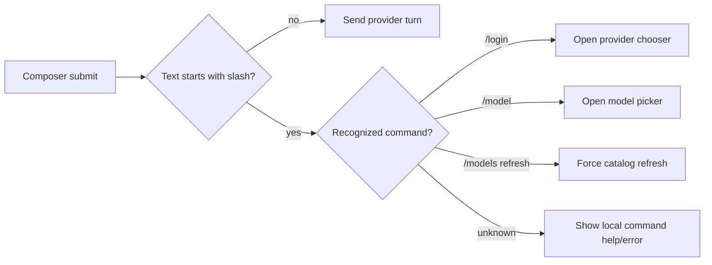

# Design: Provider Model Catalog, Login Commands, and Compact Chat Controls

## Context

Current state in `fix-native-chat-composer-and-harness`:

- Native chat already has provider/model/effort state in `ChatPanel.tsx` and typed Tauri wrappers in `src/lib/native-chat.ts`.
- Provider credentials can be saved manually and via a loopback/web flow in `provider_login_service.rs`.
- The composer header renders provider, model, effort, health, connect/disconnect, spacer, and `Generate ideas` as peer controls. CSS currently permits wrapping (`.chat-composer-header { flex-wrap: wrap; }`, `.chat-select-group { flex-wrap: wrap; }`), which is the immediate reason the controls can become multi-line.
- The current browser-accessible Vite frontend crashes outside Tauri because Tauri `invoke` is unavailable; the desktop screenshot was captured separately at `artifacts/basebuild-desktop-screenshot.png` for visual follow-up.

External patterns reviewed:

- Oh My Pi exposes `omp models` with `ls`, `find`, and `refresh`; `refresh` forces an online catalog fetch and `ls/find` use `online-if-uncached`. Its `ModelRegistry` merges bundled models, dynamic discovery, runtime providers, provider auth state, and a local `models.db` cache. It prefers authoritative runtime provider catalogs and keeps stale cached catalogs usable when online discovery fails.
- Oh My Pi separates auth from catalog: `auth-broker login/list/logout/status` manages OAuth/API-key credentials, while model resolution checks auth availability without refreshing tokens on every UI list operation.
- Oh My Pi discovery supports OpenAI-compatible `/v1/models`, Ollama, llama.cpp, LM Studio, LiteLLM/new-api/one-api-style proxies, and bundled provider-model managers.
- Dream keeps the UI simple by using one provider-model endpoint (`POST /api/provider-models`) that can refresh all providers or one provider, returns `{ provider: { installed, models, source, version, error }, fetchedAt }`, normalizes labels/reasoning efforts/context windows, dedupes models, and falls back to defaults when a CLI has no stable model-listing command.

## Goals / Non-Goals

**Goals**:
- Make chat controls compact enough to read as one approachable command bar instead of a wrapped form.
- Support multiple providers connected simultaneously.
- Automatically sync provider model catalogs and expose manual refresh.
- Add slash commands that open UI for login/model choice without replacing visible controls.
- Keep credentials local-first and never send secrets to the hosted fallback catalog.

**Non-Goals**:
- Do not implement a remote credential vault or phone-home analytics.
- Do not require slash commands for provider/model workflows.
- Do not add inline styles or a second stylesheet.
- Do not query a hosted Basebuild catalog when direct provider/CLI discovery is available.

## Decisions

**Decision**: Add a backend provider-model catalog service instead of putting discovery logic in React. — **Rationale**: `src/lib/*` must stay thin invoke wrappers, credentials are backend-owned, and Rust can centralize cache/secret handling. **Alternatives**: Frontend fetches provider APIs directly; rejected because it exposes secrets and duplicates provider logic.

**Decision**: Use a cache-first, refresh-in-background model flow. — **Rationale**: Mirrors OMP's `online-if-uncached` behavior and keeps model selectors usable during network/provider failures. **Alternatives**: Always block UI on fresh online sync; rejected because provider APIs and CLIs are often slow or unavailable.

**Decision**: Prefer provider/CLI model payloads, then OpenAI-compatible `/v1/models`, then hosted Basebuild fallback. — **Rationale**: Authoritative direct data avoids drift; hosted fallback is only for providers with no list API. **Alternatives**: Static bundled list only; rejected because model catalogs change often.

**Decision**: Model catalog responses should include source and freshness metadata. — **Rationale**: Users need to know whether a list came from provider-discovered, CLI-discovered, hosted-fallback, bundled, or stale-cache data. **Alternatives**: Hide source; rejected because troubleshooting login/model drift becomes opaque.

**Decision**: Implement slash commands as composer-local commands before send. — **Rationale**: `/login` and `/model` should open UI, not consume model tokens or leak local command intent to providers. **Alternatives**: Send slash commands to providers and ask them to call tools; rejected because it is slower, less reliable, and privacy-hostile.

**Decision**: Keep the visible UI as the primary path and slash commands as accelerators. — **Rationale**: The user explicitly asked for UI next to effort level and slash commands; this matches Dream's simple visible controls while preserving keyboard speed. **Alternatives**: Slash-only command palette; rejected as less discoverable.

**Decision**: Collapse secondary composer actions into an overflow menu on narrow widths. — **Rationale**: Provider/model/effort are primary; `Generate ideas`, disconnect, and refresh details can move behind icons before the rail wraps. **Alternatives**: Allow wrapping; rejected by the screenshot-driven requirement.

## Proposed Data Shape

Backend catalog response:

```ts
type ProviderModelCatalog = {
  providers: Array<{
    id: string;
    label: string;
    configured: boolean;
    supportsWebLogin: boolean;
    modelCount: number;
    lastSyncedAt: number | null;
    source: "bundled" | "provider_discovered" | "cli_discovered" | "hosted_fallback" | "stale_cache" | "unavailable";
    error: string | null;
  }>;
  models: Array<{
    id: string;
    providerId: string;
    label: string;
    contextWindow: number | null;
    maxTokens: number | null;
    supportsReasoning: boolean;
    supportedEfforts: string[];
    supportsImages: boolean;
    source: string;
  }>;
  fetchedAt: number;
  stale: boolean;
};
```

Commands:

- `native_provider_catalog()` — cache-first catalog for initial render.
- `native_provider_catalog_refresh(provider_id?: string, force?: boolean)` — online refresh all or one provider.
- Existing login/disconnect commands call refresh for the affected provider after success.

## Provider Discovery Strategy

1. Built-in local/offline provider returns its bundled local coordinator model and never attempts network.
2. OpenAI-compatible providers use stored credential/base URL to call `/v1/models` when available.
3. Provider-specific clients use direct payloads when known: for example Codex/ChatGPT model payloads, Anthropic/Claude Code public/model metadata, or CLI-discovered model lists when a provider CLI is the source of truth.
4. If direct discovery is not available, query the Basebuild hosted model directory for public metadata by provider id/version; never include credentials, user prompts, project paths, or local account ids.
5. On failure, keep last cached models and mark the provider `stale_cache` with an error.

## UI Structure

Composer rail order:

1. Provider status pill/button (`OpenAI`, `Anthropic`, etc.; setup state visible).
2. Model compact select/search trigger.
3. Effort compact select.
4. Refresh icon with last-sync tooltip.
5. Connect/disconnect icon button.
6. Overflow menu for Generate ideas and lower-priority actions.

CSS rules:

- `.chat-composer-header` becomes `flex-wrap: nowrap; min-width: 0;`.
- Model/provider controls get `min-width: 0`, compact widths, and text truncation.
- Buttons can switch to icon-only at constrained widths; `title` keeps tooltips.
- Overflow menu owns actions that would otherwise force wrapping.

## Slash Command Flow



Slash command parsing happens before `nativeChatSend`. Recognized commands produce local UI events and optional system/status messages; they do not create user chat messages sent to the provider.

## Risks / Trade-offs

- Provider APIs differ and some model endpoints are incomplete → Mitigation: source metadata, cached fallback, provider-specific normalizers, hosted fallback only when necessary.
- Hosted fallback could look like phone-home → Mitigation: document exact payload, no secrets/prompts/paths, and only call when direct discovery is absent.
- Compact rail can hide too much → Mitigation: provider/model/effort stay visible; only secondary actions overflow.
- Slash commands can conflict with intended prompt text → Mitigation: unknown commands are held locally with an explicit “send as text” escape.

## Migration Plan

1. Add catalog persistence and refresh command without changing existing send behavior.
2. Wire login/disconnect to refresh provider models.
3. Replace composer rail layout and add overflow menu.
4. Add slash command parser and provider/model pickers.
5. Add optional hosted fallback integration only for providers without direct discovery.
6. Update docs and visual verification screenshots.

## Open Questions

- Which provider ids should be supported in the first hosted fallback response from `basebuild-dotnet`?
- Should the hosted fallback be opt-in in Settings, or acceptable by default because it sends only public provider ids? Conservative default: enabled only when direct discovery fails and documented in Settings.
- Should `/model` select globally across all configured providers or initially filter to the active provider? Proposed default: global search with active provider results first.
